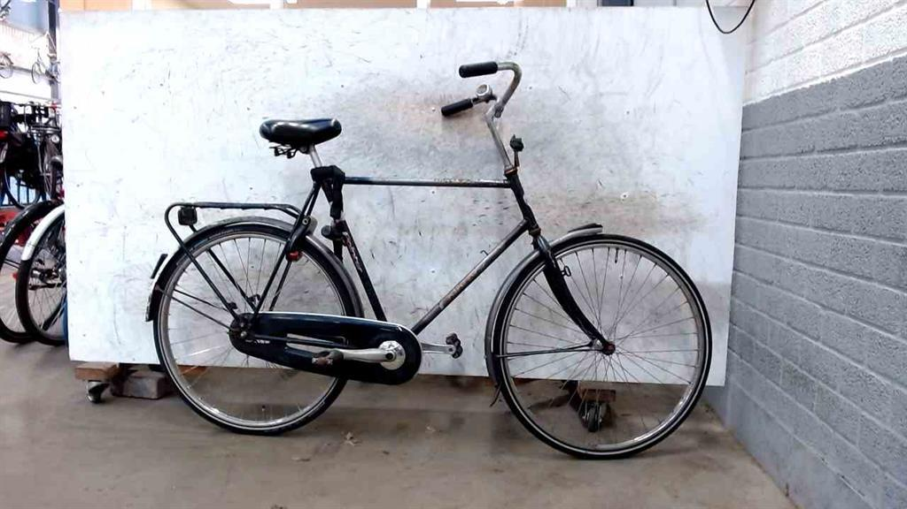

# Afac Amsterdam search

In Amsterdam illegally parked bicycles are confiscated and stored in the 'fietsdepot'.
You can search for your bicycle at <https://www.amsterdam.nl/parkeren-verkeer/fiets/fietsdepot/>.

However, apart from a date and city filter this website does not offer a full-text search to search by street or framenumber.

This repo contains a bare-bones python script to download found bicycles by date so that you can do your own search.

### Output

	Registratienummer: F0363f-1000831154
	Image: https://www.verlorenofgevonden.nl/assets/image/1048988
	Description:
	herenfiets Union ( blauw ) met framenummer 'WKM6119880'.
	Locatie gevonden: Rembrandtplein, Centrum: Rembrandtplein Amsterdam.
	Buiten voorziening  (art. 4.27 lid 4 APV) op 1-4-2022 en overgebracht naar depot Fietsdepot Bornhout 8 op 1-4-2022, opslag

	Registratienummer: F0363f-1000900715
	Image: https://www.verlorenofgevonden.nl/assets/image/1048986
	Description:
	herenfiets bel paars,banden wit ( zwart ) met framenummer 'K1885050613'.
	Locatie gevonden: Thorbeckeplein, Centrum: Rembrandtplein Amsterdam.
	Buiten voorziening  (art. 4.27 lid 4 APV) op 1-4-2022 en overgebracht naar depot Fietsdepot Bornhout 8 op

	Registratienummer: F0363f-1000831405
	Image: https://www.verlorenofgevonden.nl/assets/image/1048972
	Description:
	herenfiets VanMoof lakschade ( zwart ) met framenummer 'ASY1036434'.
	Locatie gevonden: Bakkersstraat, Centrum: Rembrandtplein Amsterdam.
	Buiten voorziening  (art. 4.27 lid 4 APV) op 1-4-2022 en overgebracht naar depot Fietsdepot Bornhout 8 op 1-4-2
